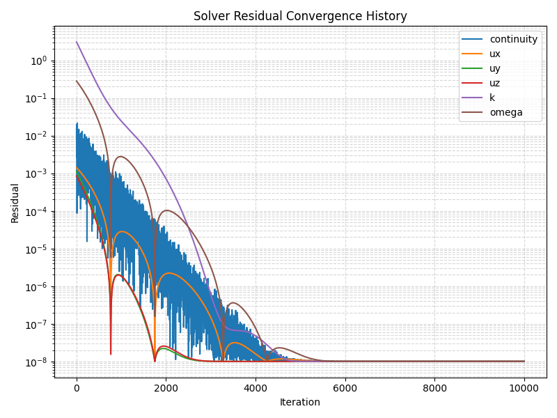
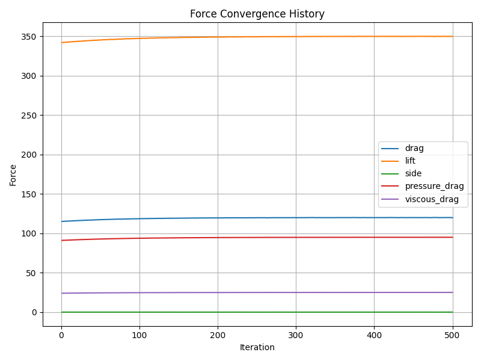

# AI-Assisted CFD Solver Diagnostics & Post-Processing

A physics-aware Python framework for CFD post-processing, solver diagnostics,
and convergence validation using residuals, forces, and probes.

## Why this project makes a difference?
CFD users often rely on residual plots alone to judge convergence.
In practice, residuals can be misleading and hide pseudo-convergence.

This project demonstrates a solver-engineer approach to CFD validation using:
- Residual decay analysis
- Force convergence checks
- Physics-aware solver verdict logic

## Example solver diagnostics

The following plots are automatically generated by the diagnostic scripts
and are used to validate numerical and physical convergence.

### Residual convergence history
Residual decay plotted on a logarithmic scale for continuity, momentum,
and turbulence equations.

### Force convergence history
Convergence of integrated forces, including drag decomposition and side force.

=======

